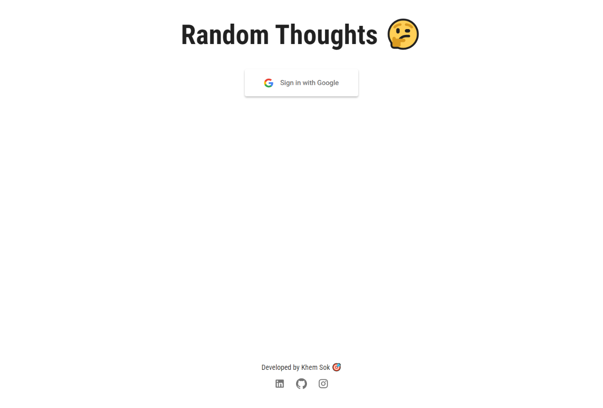

<h1>Random Thoughts 🤔</h1>

Write down your random thoughts... 💭

### Features 🎨

- **🔐 Authentication**: Claim based authentication with Google identity provider
- **📄 Database**: Store user data with Firebase
- **✍Thoughts**: Write down your thoughts to look back at later
- **⏳ Update/Delete**: Update and delete thoughts

### Technologies 🔨

- **⚡NextJS**: Frontend and backend
- **🔥 Firebase**: Database and authentication

### Developed by [Khem Sok](https://github.com/khemsok) 🧐

Thanks For Reading!
